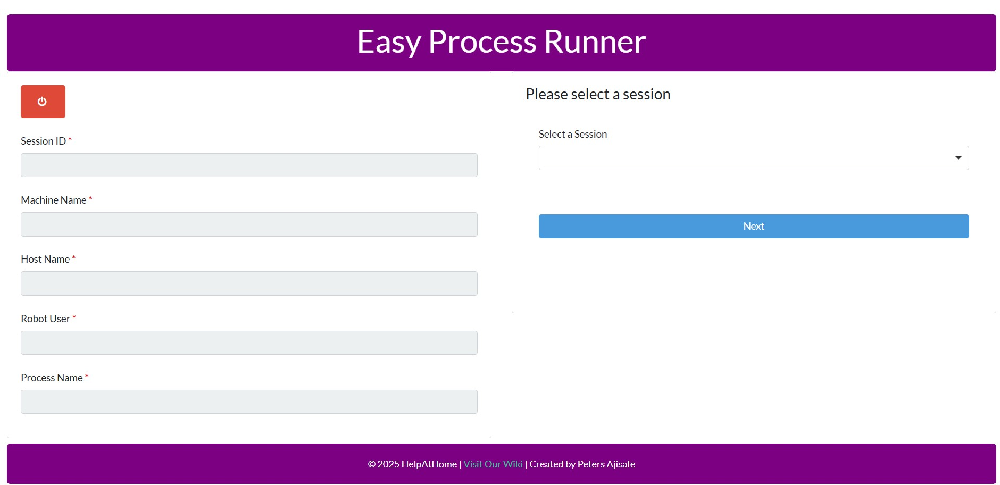

# ProcessStarter.RPA.Uipath.Process

A UiPath RPA process that provides an interactive dashboard for starting and managing RPA processes through a user-friendly form interface. This application allows users to select sessions, robots, and processes, then execute them with appropriate parameters.



## Overview

The Process Starter is a comprehensive UiPath application that serves as a centralized hub for managing and executing RPA processes. It provides an intuitive interface for users to:

- Select available robot sessions
- Choose robot users and processes
- Configure process-specific parameters
- Execute processes with proper validation
- Monitor process execution status

## Features

### 🎯 **Interactive Dashboard**
- User-friendly form interface with modern UI design
- Multi-step workflow for process selection and configuration
- Real-time validation and error handling
- Loading indicators and progress feedback

### 🤖 **Session & Robot Management**
- Dynamic session selection from available robot sessions
- Robot user account management
- Machine and host information display
- Session validation and status checking

### ⚙️ **Process Configuration**
- Dynamic process list loading from Orchestrator
- Process-specific parameter configuration
- File upload capabilities for processes requiring input files
- Date/time parameter selection for time-sensitive processes

### 🔧 **Supported Process Types**
- **AlayaCare Processes**: Time-based processes with date range selection
- **Overhead Adjustment V1**: Excel file upload for invoice processing
- **Overhead Adjustment V2**: Enhanced version with improved file handling
- **Attended Automations**: Interactive processes requiring user input

### 📊 **Configuration Management**
- Excel-based configuration system (`Data/Config.xlsx`)
- Company branding and customization
- Wiki integration and support links
- Error message management and display

## Project Structure

```
ProcessStarter.RPA.Uipath.Process/
├── Backend/                          # Backend process workflows
│   ├── InOverheadAdjustmentV1.xaml
│   └── InOverheadAdjustmentV2.xaml
├── Data/                             # Configuration and data files
│   └── Config.xlsx                   # Main configuration file
├── Documentation/                    # Project documentation
│   └── Simple.txt
├── Forms/                           # User interface forms
│   └── StartForm.uiform            # Main dashboard form
├── Project/                         # Core workflow components
│   ├── CreateFoldersIfNotExisting.xaml
│   ├── GenerateAppSessions.xaml
│   ├── GetAccessToken.xaml
│   ├── GetListOfProcesses.xaml
│   ├── GetListOfSession.xaml
│   ├── GetListOfUsers.xaml
│   ├── InitializeConfig.xaml
│   ├── KillExcel.xaml
│   ├── LoadAttendedAutomationList.xaml
│   ├── LoadDashboradForm.xaml
│   ├── LoadMachineToUserTable.xaml
│   ├── QuickStartJob.xaml
│   ├── SetPageName.xaml
│   ├── StartJobOrchestratorAPI.xaml
│   ├── UpdateConfigurationFile.xaml
│   └── UploadFileToStorageBucketUsingOrchAPI.xaml
├── Triggers/                        # Form event triggers
│   ├── BackButtonTrigger.xaml
│   ├── ChooseFileButtonTrigger.xaml
│   ├── ExitButtonTrigger.xaml
│   ├── NextButtonTrigger.xaml
│   ├── SelectRobotTrigger.xaml
│   └── StartProcessButtonTrigger.xaml
├── Main.xaml                        # Main workflow entry point
├── project.json                     # Project configuration
├── entry-points.json               # Entry point definitions
└── README.md                       # This file
```

## Dependencies

### UiPath Packages
- **UiPath.Excel.Activities** `[3.1.1]` - Excel file operations and data handling
- **UiPath.Form.Activities** `[25.4.3]` - Form creation and user interface components
- **UiPath.IntegrationService.Activities** `[1.15.0]` - Integration service activities
- **UiPath.System.Activities** `[25.6.1]` - Core system activities and utilities
- **UiPath.WebAPI.Activities** `[2.0.0-preview]` - Web API integration capabilities

### Project Configuration
- **Studio Version**: 25.0.172.0
- **Target Framework**: Windows
- **Expression Language**: VisualBasic
- **Runtime Options**: 
  - Auto-dispose: false
  - Pausable: true
  - Attended: false
  - Requires user interaction: true

## Configuration

The application uses `Data/Config.xlsx` for configuration management. Key configuration areas include:

### Settings Sheet
- **Company Information**: Company name, creator details, wiki URL
- **Orchestrator Settings**: Connection details and API endpoints
- **Process Configuration**: Available processes and their parameters
- **UI Customization**: Branding and display preferences

## Workflow Process

### 1. **Initialization** (`InitializeConfig.xaml`)
- Loads configuration from Excel file
- Validates required settings and connections
- Prepares environment variables

### 2. **Dashboard Loading** (`LoadDashboradForm.xaml`)
- Displays the main user interface
- Loads available sessions, robots, and processes
- Sets up form validation and event handlers

### 3. **Session Selection**
- User selects from available robot sessions
- Displays session details (ID, machine name, host name)
- Validates session availability and status

### 4. **Robot & Process Selection**
- User selects robot user account
- Chooses from available processes
- Validates process compatibility and requirements

### 5. **Parameter Configuration**
- Displays process-specific parameter forms
- Handles file uploads for processes requiring input files
- Validates parameter values and file formats

### 6. **Process Execution** (`QuickStartJob.xaml`)
- Starts the selected process with configured parameters
- Monitors execution status
- Handles errors and provides user feedback

## Form Interface Details

### Main Dashboard Features
- **Session Information Panel**: Displays current session details
- **Process Selection**: Dropdown for available processes
- **Parameter Configuration**: Dynamic forms based on selected process
- **File Upload**: Support for Excel and other file types
- **Action Buttons**: Start process, back navigation, exit

### Process-Specific Panels
- **AlayaCare Panel**: Date range selection for time-based processes
- **Overhead Adjustment V1**: Excel file upload for invoice processing
- **Overhead Adjustment V2**: Enhanced file handling with validation
- **Generic Process Panel**: Standard parameter collection

### Validation & Error Handling
- Real-time form validation
- File format and size validation
- Process compatibility checking
- User-friendly error messages
- Automatic cleanup on errors

## Getting Started

### Prerequisites
- UiPath Studio 25.0.172.0 or later
- Access to UiPath Orchestrator
- Valid robot sessions and processes configured
- Excel configuration file properly set up

### Setup Instructions
1. Clone or download this repository
2. Open the project in UiPath Studio
3. Configure `Data/Config.xlsx` with your settings:
   - Company information and branding
   - Orchestrator connection details
   - Available processes and parameters
4. Ensure all required processes are published to Orchestrator
5. Run the process from Studio or publish to Orchestrator

### Configuration Requirements
- Valid Orchestrator access with process execution permissions
- Robot sessions must be available and running
- Processes must be published and accessible
- Configuration file must contain all required settings

## Usage

### Starting the Application
1. Run the `Main.xaml` workflow
2. The dashboard form will load automatically
3. Follow the step-by-step process selection

### Process Selection Workflow
1. **Select Session**: Choose from available robot sessions
2. **Select Robot**: Choose the robot user account
3. **Select Process**: Choose the process to execute
4. **Configure Parameters**: Set process-specific parameters
5. **Start Process**: Execute the process with selected parameters

### Supported Process Types
- **Time-based Processes**: Configure start/end dates and times
- **File-based Processes**: Upload required input files
- **Interactive Processes**: Provide user input parameters
- **Automated Processes**: Execute with minimal user intervention

## Error Handling

The application includes comprehensive error handling:
- Form validation with real-time feedback
- Process compatibility checking
- File validation for uploads
- Session and robot availability validation
- User-friendly error messages and recovery options
- Automatic cleanup on failure

## Customization

### UI Customization
- Modify `Forms/StartForm.uiform` for interface changes
- Update CSS styles in the form configuration
- Customize branding and company information

### Process Integration
- Add new process types in the form configuration
- Create new parameter panels for specific processes
- Update process validation logic as needed

### Configuration Management
- Modify `Data/Config.xlsx` for settings changes
- Add new configuration parameters as required
- Update process lists and parameters

## Troubleshooting

### Common Issues
1. **Session Not Available**: Ensure robot sessions are running and accessible
2. **Process Not Found**: Verify processes are published to Orchestrator
3. **File Upload Errors**: Check file format and size requirements
4. **Configuration Errors**: Validate Excel configuration file format

### Debug Steps
1. Check Orchestrator connectivity
2. Verify robot session status
3. Validate process availability
4. Review configuration file settings
5. Check error messages in the application

## License

See `LICENSE` for details.

## Support

For issues or questions:
1. Check the configuration settings in `Data/Config.xlsx`
2. Verify Orchestrator and robot session availability
3. Review process requirements and parameters
4. Check the application error messages for specific details

## Contributing

To contribute to this project:
1. Fork the repository
2. Create a feature branch
3. Make your changes
4. Test thoroughly
5. Submit a pull request

---

**Note**: This application is designed for internal use and requires proper UiPath Orchestrator setup and robot session management.